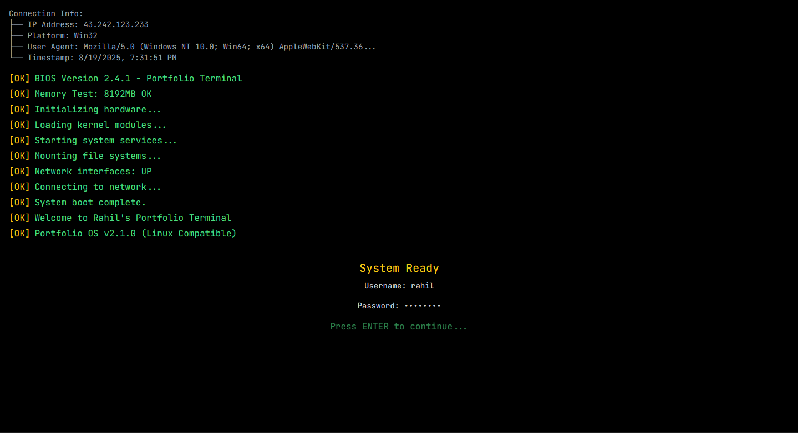
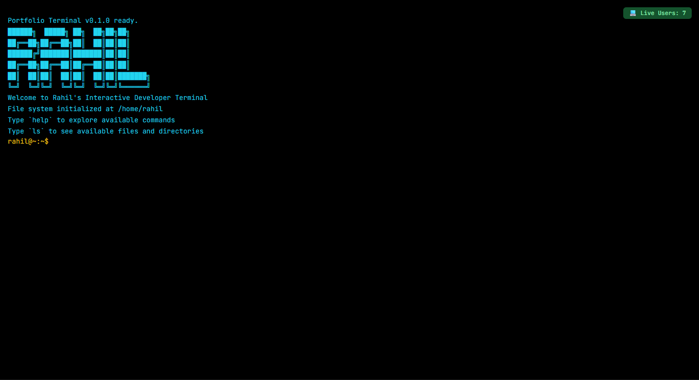
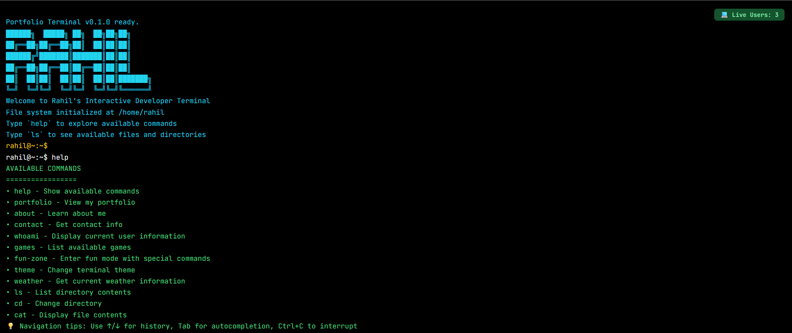
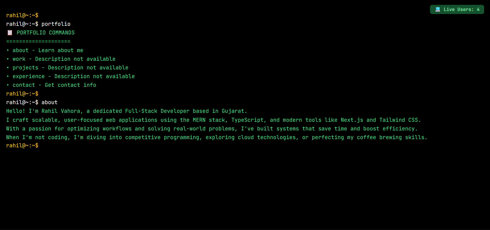
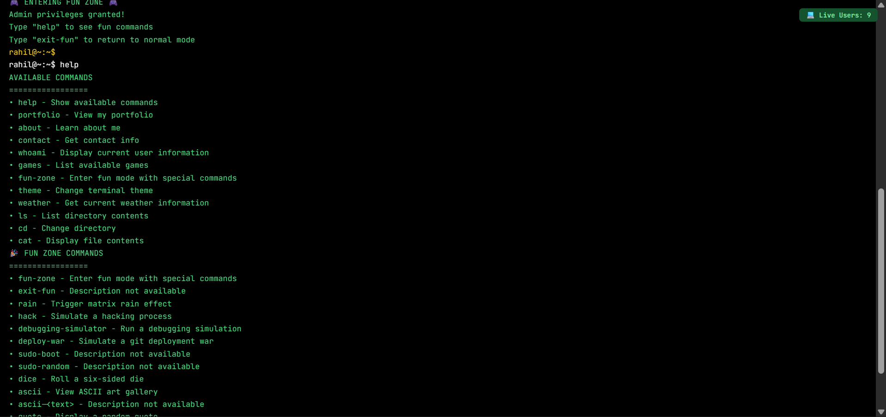
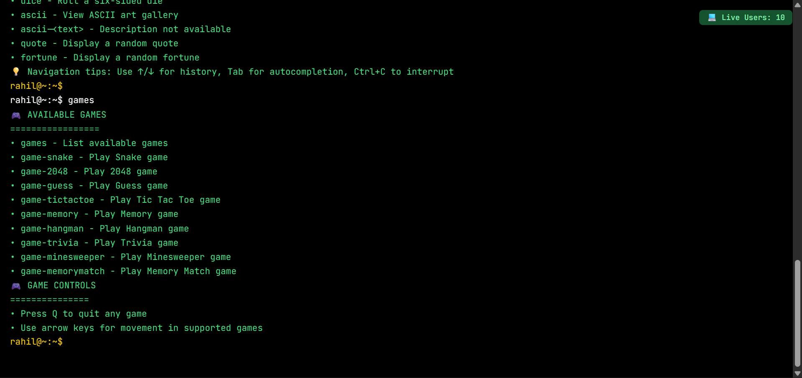
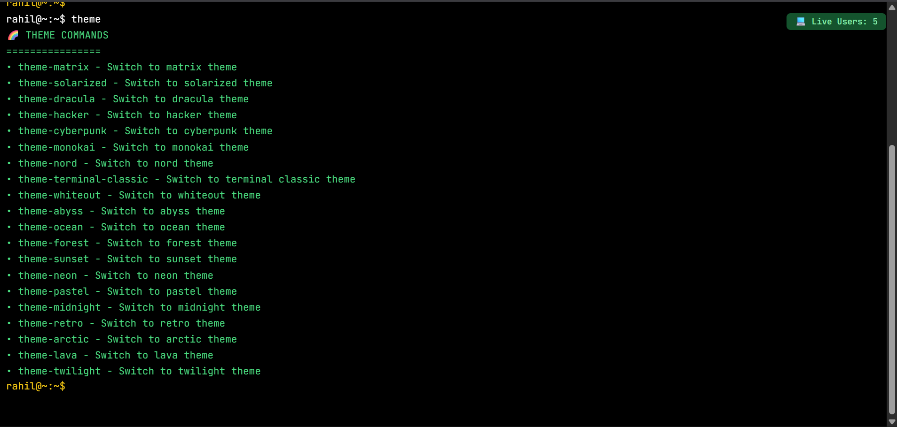

# 🖥️ Rahil’s Terminal Portfolio

An **interactive terminal-style developer portfolio** built with **Next.js**, **TypeScript**, and **TailwindCSS**.  
It simulates a real Linux shell where users can run commands to explore my projects, skills, and fun extras — all from the comfort of a terminal UI.  

![Demo Screenshot]
*Landing screen with terminal UI*

*Welcome Screen*

---

## ✨ Features

- ⚡ **Terminal-like Interface** — feels just like a Linux shell
- 👤 **Live Visitor Count** — see how many users are currently online
- 📝 **Portfolio Section** — explore projects, experience, and skills
- 🎮 **Fun Zone & Games** — small text-based games and challenges
- 🎨 **Custom Themes** — switch terminal themes dynamically
- 🔤 **ASCII Arts** — generate cool ASCII banners & art
- 💻 **Linux-style Commands** — commands like `help`, `ls`, `about`, `projects`, `clear`, etc.

---

## 🖼️ Screenshots

> Add screenshots in `./public/screenshots/` folder and update paths below

### 🔐 Home / Welcome Screen

### 📂 Portfolio Commands

### 🚩 Fun Zone

### 🎮 Games

### ✒️ Themes

### 🎨 ASCII Art Generator

---

## 🛠️ Tech Stack

- [Next.js](https://nextjs.org/) — React framework for server-side rendering & routing  
- [TypeScript](https://www.typescriptlang.org/) — type-safety and DX  
- [TailwindCSS](https://tailwindcss.com/) — utility-first styling  
- [Vercel](https://vercel.com/) — hosting & deployments  

---

## 🧑‍💻 Commands (examples)

| Command      | Description             |
| ------------ | ----------------------- |
| `help`       | Show available commands |
| `about`      | About me                |
| `projects`   | List my projects        |
| `experience` | Show work experience    |
| `skills`     | My skills               |
| `contact`    | Contact info            |
| `fun-zone`   | Access fun-zone         |
| `games`      | Access various games    |
| `ascii`      | Generate ASCII art      |
| `themes`     | Switch terminal themes  |
| `clear`      | Clear the terminal      |
| `ls`         | List files (projects)   |
| `cat <file>` | View file content       |
| `echo <text>`| Print text to terminal  |

---

## 📊 Live User Count

> Integrated with a simple WebSocket / API that tracks concurrent visitors.
> You’ll see the current online users in the top-bar of the terminal.

---

## 📦 Deployment

Deployed on **Vercel**. You can view the live version at [https://terminal.rahil.pro](https://terminal.rahil.pro).

## 🤝 Contributing

PRs are welcome!
If you’d like to suggest commands, games, or features, feel free to open an [issue](https://github.com/rahil/terminal-portfolio/issues).

---

## 📜 License

This project is open-source under the [GPL-3.0-only](LICENSE).

---

## 👨‍💻 Author

**Rahil**

* Twitter: [@Rahil\_Vahora12](https://twitter.com/Rahil_Vahora12)
* Portfolio: [https://terminal.rahil.pro](https://terminal.rahil.pro)

